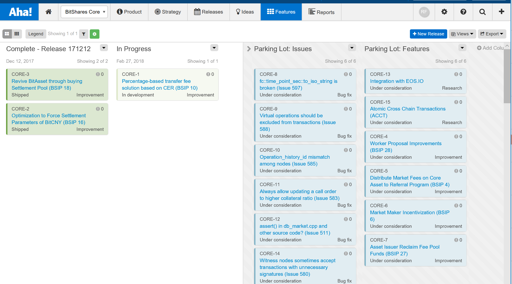

DRAFT 4.0
=========

* Change: messaging to focus on professional, dedicated development team, 'salaried' compensation
* Fix: UX/UI Liaison rate to range
* Add: Section for Initial Team Members
  * Move: Ryan R. Fox - Coordinator into this section
  * Add: Header for Peter and Taconator (they need to supply a bio blurb)
  * Add: Header for Bill (I modified his blurb from the recent UI proposal)

BitShares Core Team Budget Worker Proposal - 2018 (`"1.14.XX"`)
===============================================================

Author: Ryan R. Fox (`"fox"`)

Intent
======

* Establish a budget to sustain the development efforts of the BitShares Core Team
* Define a framework for the Core Team to collaborate within
* Deliver transparent communication of BitShares development efforts to the community

Background
==========

Currently the BitShares Core software is maintained by a few gracious individuals either volunteering their time or receiving funding through distinct short-term worker proposals. The BitShares Community has expressed interest securing a long term, dedicated and professional development team capable of more rapidly delivering high value features in a transparent way. BitShares is global platform and so too is the desired development team composition. A large volume of feature enhancements, bug fixes and BSIPs exist for the team to work from.

Backlog (Sample Screenshot)
===========================

Worker
======

This is a Budget Worker Proposal (`"1.14.XX"`) which provides funding through calendar year 2018 for:
* BitShares Core Team Roles
* Collaboration Tools

It intends to work in concert with the existing development resources including Abit, Alfredo Garcia, and the UI Team, led by Bill Butler. BTS are collected into the `"bitsharesdev"` account (`"1.2.2386"`) which is a multi-sig account controlled by `"BitShares Blockchain Foundation"` and the `"committee-account"` using the Budget Worker Model [5]:

* Transparent accounting provided by the BitShares Blockchain Foundation [6]
* Submitted invoices reviewed, approved and remitted within 5 business days
* Compensation paid in bitUSD (default) or bitCNY (Team Member may define upon first invoice)
* All unused accumulated BTS returned to the Reserve Pool at the conclusion of the Worker

Core Team Roles
===============

The BitShares Core Team is a self-organizing agile-principled team focused on delivering regularly scheduled releases and ad hoc bug fixes for the BitShares Core software. The table below describes the target composition of the team at full utilization for budget purposes only. The actual number of contributors and roles may vary within each development cycle (described below). The team has discretion in allocating resources to meet the needs of each development cycle. A goal is to rapidly grow into and sustain a dedicated team approximating the composition below.

* BitShares Core Team Budget:

| Roles (described below)  | Rate Range (Hourly USD) | Estimated Hours |
|:------------------------ | -----------------------:|:--------------- |
| Coordinator              |             $125 - $150 | 40 hours weekly |
| Core Developer           |             $125 - $200 | 40 hours weekly |
| Core Developer           |             $125 - $200 | 40 hours weekly |
| Core Developer           |             $125 - $200 | 40 hours weekly |
| Business Analyst         |              $75 - $125 | 40 hours weekly |
| Business Analyst         |              $75 - $125 | 20 hours weekly |
| QA/Tester                |              $75 - $125 | 30 hours weekly |
| Documentation Specialist |              $60 - $ 90 | 30 hours weekly |
| UI/UX Liaison            |              $75 - $125 | 10 hours weekly |

* Development Cycles*:
  * Feature Release (non-hard fork):
  * Three-week sprints

* Core Release (Hard Fork):
  * Twice annually: first Thursday of June & December

*Subject to change upon consensus of Core Team Members

BitShares Core Team Framework:
==============================
Collegiality
* Maintain timely collaborative communications with each BitShares Core Team Member
* Target a majority of your weekly hours between Tuesday - Thursday
  * Facilitates ad hoc collaboration
  * Facilitates healthy work/life balance

Transparency
* Maintain working increments within Community facing collaboration tools
* Participate in at least two of three weekly Collaboration Sessions (see Coordinator description)

Delivery
* Deliver the highest value work first
* Deliver working increments with invoice submission
* Favor release schedule over feature completeness

BitShares Core Team Member 'Contract Work' Guidance:
====================================================

This section is to be considered guidance, not a legal statement. The BitShares Decentralized Autonomous Community (BitShares DAC) 'owns' the funds collected by this Budget Worker and are made available as compensation to individuals performing 'contract worker' as described elsewhere in this document. Effort contributed by individuals is considered 'at-will' as no formal 'employment contract' is able to be formed between BitShares DAC and the 'contract worker' at this time. Neither the BitShares Blockchain Foundation (BBF) nor the BitShares Committee or any individuals serving those entities are considered 'employers' of any 'contract worker'. The Coordinator, nor any other BitShares Core Team Member or Role is considered the 'boss' nor an 'employer' of any individual. Any compensation received from the BitShares DEX is likely considered 'earned income' and may be subject to tax reporting by the recipient. The BitShares DAC, BBF, BitShares Committee, Coordinator, nor any Core Team Member will not prepare nor issue 'tax documents' to any entitiy. All effort performed is a 'work for hire' contribution to the BitShares DAC adhering to its MIT license.

The BitShares Core Team value a healthy work/life balance and sustainable compensation. Each Core Team Member is encouraged to contribute no more hours than is customary in their jurisdiction for 'full time equivalent' work, as the role is considered 'exempt' from overtime compensation. A goal is to provide the equivalent of an annual 'salaried position' with two weeks holiday. To accommodate this, the equivalent of 40 hours of 'base pay' will be remitted to the Core Team Member upon accumulating 1000 hours within a rolling 12-month period, thus resetting both counters. National and religious observances are also important to a healthy work/life balance. Up to ten 8-hour 'observance days' are paid per calendar year, prorated to the rate and average working days in the week before and after the week containing the observance day.

Each BitShares Core Team Member performing effort for the BitShares DAC acknowledges no recourse nor remedy is available from the BitShares DAC, any other BitShares Core Team Member nor author.

Initial BitShares Core Team
===========================

* Initial BitShares Core Team:

| Roles (described below)  | Rate Range (Hourly USD) | Team Members | Estimated Hours |
|:------------------------ | -----------------------:|:------------ |:--------------- |
| Coordinator              |             $125 - $150 | Ryan R. Fox  | 40 hours weekly |
| Core Developer           |             $125 - $200 | Peter Conrad | 10 hours weekly |
| Core Developer           |             $125 - $200 | -            | -               |
| Core Developer           |             $125 - $200 | -            | -               |
| Core Developer           |             $125 - $200 | -            | -               |
| Business Analyst         |             $ 75 - $125 | Taconator    | 40 hours weekly |
| Business Analyst         |             $ 75 - $125 | -            | -               |
| QA/Tester                |             $ 75 - $125 | -            | -               |
| Documentation Specialist |             $ 60 - $ 90 | -            | -               |
| UI/UX Liaison            |                    $125 | Bill Butler  | 2 hours weekly  |

Ryan R. Fox - Coordinator
=========================

I have actively contributed to BitShares from its inception. You will find my account (`"1.2.167"`) within the genesis block and many bitsharestalk.org threads from 2014 detailing my testing feedback as we iterated toward launching the BitShares blockchain [1-4]. I have extensive professional background in project management with software development teams and am a professional scrum master (PSM-1) with extensive multi-national experience in financial services, mortgage banking and manufacturing. I now propose to use my industry knowledge, professionalism and deep BitShares expertise in an expanded role to meet the emerging needs of the community. 

Peter Conrad - Core Developer
=============================
Draft: I am awaiting a blurb to include here. It will include both crypto and industry experience. I may want to include a reference to my GitHub, LinkedIn or other platforms [#].

Taconator - Business Analyst
============================
Draft: I am awaiting a blurb to include here. It will include both crypto and industry experience. I may want to include a reference to my GitHub, LinkedIn or other platforms [#].

Bill Butler - UX/UI Liaison
===========================
Draft: I have extensive industry experience: Founded an ISP in 1993. NodeJS, Angular, PHP, CouchDB, SQL. UX/UI Experience. I am currently VP Engineering for a healthcare software development firm and have eight years experience managing development teams. I may want to include a reference to my GitHub, LinkedIn or other platforms [#].

Coordinator (Full Time - 40 hours per week)
===========================================
Onsite Office 
* Co-working space Boston, MA, US
* Monday – Friday with additional meetings as necessary

Collaboration Sessions
* 02:00 - 04:00 UTC Tuesday
* 19:00 - 21:00 UTC Wednesday
* 11:00 - 13:00 UTC Thursday

Coordinator Key Performance Indicators
* Maintain transparent communications with BitShares Community
* Maintain transparent communications with BitShares UI Project Manager
* Maintain transparent communications with Chinese Spokesperson
* Maintain transparent communications with BitShares Spokesperson
* Maintain prioritized backlog of issues/feature requests
* Maintain project roadmap
* Facilitate release cycles
  * Facilitate communication to centralized exchanges listing BitShares tokens
* Maintain physical presence for BitShares within co-working space
* Maintain a pool of candidates to select from to fulfill open roles
  * Contingency: If both a backlog of effort and an empty candidate pool for an open role exist, the accumulated budget funds may be allocated to a recruitment effort to fill the open role
* Onboard and mentor Core Team Members
* Facilitate standing collaboration sessions (Thrice weekly 2-hour blocks dispersed for international participation)
* Approve invoices submitted by Core Team Members, forward to BitShares Blockchain Foundation for remittance
* Maintain vendor relationships for collaboration tools
* Arrange accommodations for Developer Conference attendees

Core Developer (Full Time - 40 hours per week)
==============================================
The Core Developer is a seasoned C++ developer primarily tasked with writing and documenting the source code. Secondarily, the Core Developer is tasked with refining user stories, requirements and process models prior to development as well as resolving bugs during testing.

Core Developer Key Performance Indicators
* Collaborate with Business Analyst to refine user stories, requirements and process models
* Collaborate with QA/Tester on bug identification and resolution
* Collaborate with the Documentation Specialist to review documentation and ensure it matches the source code intent and implementation
* Maintain code repositories within GitHub using GitFlow principles [7]
* Contribute to Code Review of peers and provide approval for Release
* Document code for the benefit of future development efforts

Business Analyst (Full Time - 40 hours per week)
================================================
The Business Analyst is primarily tasked with writing user stories, requirements and process models. Secondarily, the Business Analyst is tasked with revising test cases with the QA/Tester.

Business Analyst Key Performance Indicators
* Maintain user stories, requirements and process models
  * Use Aha! for user stories and requirements
  * Use Blueworks Live for process models
* Collaborate with Core Developers to refine user stories, requirements and process models
* Collaborate with Documentation Specialist to revise developer documentation matches the intent of the user stories, requirements and process models.

UI/UX Liaison (Part Time - 10 hours per week)
=============================================
The UI/UX Liaison is the primary point of contact for planning, prioritizing, defining and testing UI/UX elements impacted by the implementation of the Core software. The UI Team function independently of the Core Team, but their combined efforts are interdependent. Therefore, the UI/UX Liaison is integral to delivering our feature rich Core platform.

UI/UX Liaison Key Performance Indicators
* Maintain Feature Requests related to UI/UX
* Collaborate with Business Analyst and Core Developers to refine user stories, requirements and process models

QA/Tester (Part Time - 30 hours per week)
=========================================
The QA/Tester is primarily tasked with writing test cases based on user stories, requirements and process models, then executing the tests and documenting the results. Secondarily, the QA/Tester is tasked with revising developer documentation with the Documentation Specialist.

QA/Tester Key Performance Indicators
* Maintain test cases within Aha!
* Collaborate with Core Developers to identify and document bugs in GitHub
* Collaborate with Documentation Specialist to revise developer documentation, ensuring it matches the intended workflow

Documentation Specialist (Part Time - 30 hours per week)
========================================================
The Documentation Specialist is technical writer able to interrupt test cases, user stories, requirements, process models and C++ source code. Primarily the Documentation Specialist will write documentation for the development community on the docs.bitshares.org website. Secondarily, the Documentation Specialist will work with Core Developers to revise developer documentation based on the intent of the user stories, requirements and process models to ensure they match the intent and function of the source code.

Documentation Specialist Key Performance Indicators
* Collaborate with the development community to ensure documentation supports their efforts
* Collaborate with the Core Developers to review documentation and ensure it matches the source code intent and implementation
* Collaborate with the QA/Tester and Business Analyst to enhance documentation including user stories, requirements, process models and test cases

Collaboration Tools
===================

The BitShares Core Team use various collaboration tools to organize their work, convey ideas and aid development efforts. All tools provide read/reviewer access for the community to observe progress and provide feedback. Write/contributor access may be limited to a specific Core Team role(s). Team Members are encouraged to office within a co-working space to expose the BitShares platform therein and form collaboration opportunities. A stipend is provided for full time equivalent (FTE) effort. The FTE Core Team will meet prior to each of the scheduled DevCon events for team building and in person collaboration. The Core Team will then participate in conference events in constructive ways. The tables below describe the budget for collaboration tools:

* Collaboration Tools (Monthly):

| Licenses  | Description                         | Vendor                             | Monthly (USD) |
| ---------:|:----------------------------------- |:---------------------------------- | -------------:|
| 1         | Code Repository ($0)                | GitHub (github.com)                |            $0 |
| 1         | Continuous Integration ($0)         | Travis CI (travis-ci.com)          |            $0 |
| 1         | Continuous Code Quality ($0)        | SonarCloud (sonarcloud.io)         |            $0 |
| 1         | Infrastructure Environment ($200)   | TBD                                |          $200 |
| 2         | Product Roadmap ($124)              | Aha! (aha.io)                      |          $248 |
| 2         | Process Models ($53)                | Blueworks Live (blueworkslive.com) |          $106 |
| 5         | Co-working Space for FTE ($350)     | WeWork - or similar (wework.com)   |        $1,750 |
| 1         | Translations Services ($1000)       | TBD                                |        $1,000 |

* Conference Budget:

| Accommodations | Description                          | Amount (USD) |
|:-------------- |:------------------------------------ | ------------:|
|                | DevCon Spring 2018 - Shanghai, China |              |
| 5 FTE          | Travel round trip (up to $2000)      |      $10,000 |
| 5 nights       | Lodging (up to $150)                 |       $3,750 |
| 5 days         | Meals (up to $60)                    |       $1,500 |
|                | DevCon Autumn 2018 - TBD, Europe     |              |
| 5 FTE          | Travel round trip (up to $2000)      |      $10,000 |
| 5 nights       | Lodging (up to $200)                 |       $5,000 |
| 5 days         | Meals (up to $80)                    |       $2,000 |

Budget
======

* Weekly Budget Items:

| Role (hours @ rate)                      | Amount (USD) |
|:---------------------------------------- | ------------:|
| Coordinator (40 @ $150)                  |       $6,000 |
| Core Developer (120 @ $200)              |      $24,000 |
| Business Analyst (60 @ $125)             |       $7,500 |
| QA/Tester (30 @ $125)                    |       $3,750 |
| Documentation Specialist (30 @ $90)      |       $2,700 |
| UI/UX Liaison (10 @ $125)                |       $1,250 |
| SUM WEEKLY BUDGET ITEMS                  |      $45,200 |
| CONVERTED TO DAILY BUDGET (sum / 7 days) |       $6,457 |

* Monthly Budget Items:

| Licenses  | Description (rate)                  | Amount (USD) |
| ---------:|:----------------------------------- | ------------:|
| 1         | Code Repository ($0)                |           $0 |
| 1         | Continuous Integration ($0)         |           $0 |
| 1         | Continuous Code Quality ($0)        |           $0 |
| 2         | Product Roadmap ($124)              |         $248 |
| 2         | Process Models ($53)                |         $106 |
| 1         | Infrastructure Environment ($200)   |         $200 |
| 1         | Co-working Space ($350)             |       $1,750 |
| 1         | Translation Services ($350)         |       $1,750 |
|       SUM | WEEKLY MONTHLY ITEMS                |       $3,304 |
| CONVERTED | TO DAILY BUDGET (sum / 30 days)     |         $110 |

* One-Time Budget Items:

| Accommodations | Description                          | Amount (USD) |
|:------------   |:------------------------------------ | ------------:|
|                | DevCon Spring 2018 - Shanghai, China |              |
| 5 FTE          | Travel round trip (up to $2000)      |      $10,000 |
| 5 nights       | Lodging (up to $150)                 |       $3,750 |
| 5 days         | Meals (up to $60)                    |       $1,500 |
|                | DevCon Autumn 2018 - TBD, Europe     |              |
| 5 FTE          | Travel round trip (up to $2000)      |      $10,000 |
| 5 nights       | Lodging (up to $200)                 |       $5,000 |
| 5 days         | Meals (up to $80)                    |       $2,000 |
| SUM            | ONE-TIME BUDGET ITEMS                |      $32,250 |
| CONVERTED      | TO DAILY BUDGET (sum / 46w / 7d)     |         $100 |

* Sum Daily Budget Items:

| Description            | Amount (USD) |
|:-----------------------| ------------:|
| Weekly Budget Items    |       $6,457 |
| Monthly Budget Items   |         $110 |
| One-Time Budget Items  |         $100 |
| SUM DAILY BUDGET ITEMS |       $6,667 |

Duration and Pay
================

This proposal will last for roughly 46 weeks, starting from 12th February 2018.

Payments:
* Invoices from Core Team Members will be submitted to the Coordinator by Monday 12:00 UTC for work performed thru Sunday 23:59 UTC of the previous period
* Coordinator will review and approve submitted invoices, then forward to BitShares Blockchain Foundation for direct payment to Core Team Members
* Coordinator will review and approve vendor invoices, then forward to BitShares Blockchain Foundation for direct payment to vendor

Calculation:
* 1.84 BTS/bitUSD = Settlement price of bitUSD at the moment of writing (2018-01-27)
* 2.5 = Collateral multiplier to cover market fluctuations and borrow with 2.5x collateral, as needed
* $6,667 USD/day * 1.84 BTS/USD * 2.5 collateral multiplier= 30,668 BTS/day

USD payment will be in bitUSD with method developed by @xeroc [8]. CNY payment may be requested and fulfilled with bitCNY using 6.37 USD/CNY. A Core Team Member must declare their payment method with their first invoice and may not change it during calendar year 2018. Contingency: should world events disrupt the USD/CNY rate by +/- 10%, the invoice will be remitted in bitUSD to honor the budget.

References
==========

* [1] BitShares Talk Profile: [fox](https://bitsharestalk.org/index.php?action=profile;u=5333)
* [2] GitHub Repo: [ryanRfox](https://github.com/ryanRfox)
* [3] LinkedIn Profile: [ryanRfox](https://linkedin.com/in/ryanRfox)
* [4] Twitter Profile: [ryanRfox](https://twitter.com/ryanRfox)
* [5] BBF [Budget Worker Template](http://www.bitshares.foundation/worker/)
* [6] BBF [Transparent Accounting](http://www.bitshares.foundation/accounting)
* [7] BitShares [GitFlow](https://github.com/bitshares/bitshares-core/wiki/Git-Flow)
* [8] Xeroc's [Worker Payment Template](https://github.com/xeroc/worker-proposals/blob/master/2017-02.md#worker)

